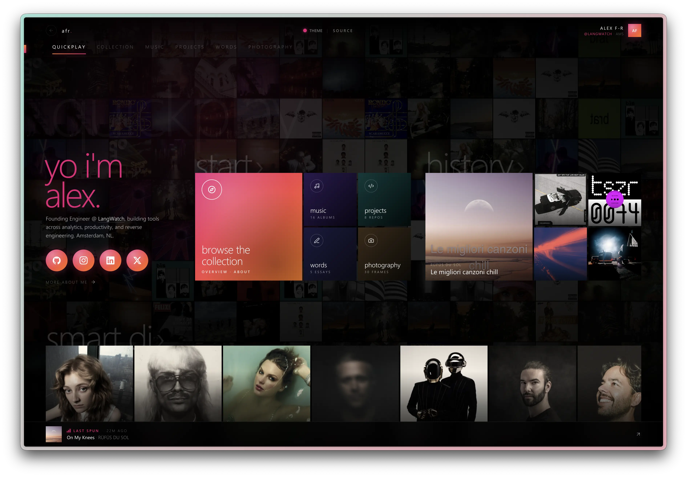

# alex.forbes.red

personal site, super serious.



zune-flavoured pivot nav. albums + artists from stats.fm, likes from
soundcloud, frames from instagram, repo stats from github. pre-rendered
at build time so it lands as a real page, not a spinner.

## stack

just html, css, and a sprinkle of vanilla js. no framework, no bundler.
build script is `tsx scripts/build.ts` — pulls every upstream, writes
`data/snapshot.json`, and SSRs every dynamic section into `index.html`
via `<!--ssr:NAME--><!--/ssr-->` markers. cron runs it every 30 minutes
and commits the diff; the push triggers github pages.

## hacking on it

```bash
make help           # list targets
make dev            # local static server on :8765
make build          # full build — hits every upstream
make build-offline  # SSR-only, reuses data/snapshot.json (no api calls)
make build-github   # refresh github stats (after editing content.json)
make check          # typecheck + offline rebuild
```

curated content (projects + essays) lives in `data/content.json` — edit
that by hand. live snapshots (`data/snapshot.json`, `images/`) belong to
the cron, leave them alone.
